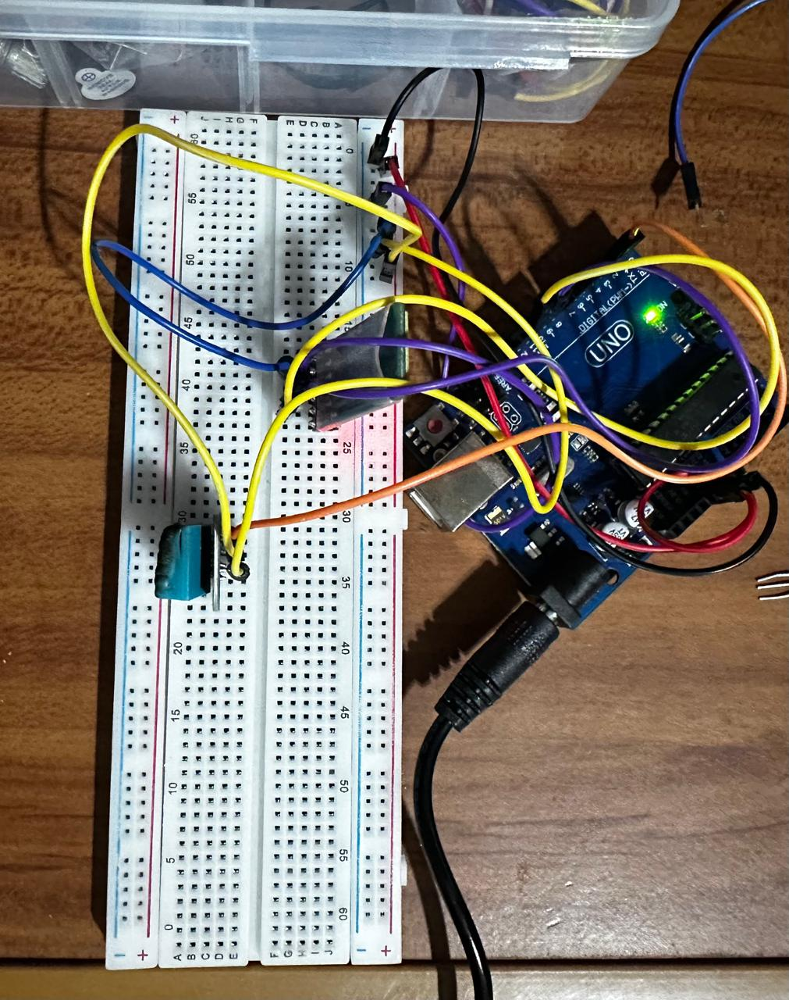

# 🌡️ **Temperature Sensor with Bluetooth and DHT11** 🌡️

This project uses a **DHT11** sensor to measure the temperature and transmits the data via Bluetooth using the **HC-05** communication module. The data is also displayed in a graphical interface created with **Windows Forms** in **Visual Studio Community**. The thermometer graphic changes color and state based on the received temperature. 💻

## Features 🚀

- **Temperature reading** using a **DHT11** sensor. 🌡️
- **On-screen display** with labels showing the temperature and state (Cold, Warm, Hot). 🖥️
- **Data transmission** via **Bluetooth** using the HC-05 module. 🔗
- **Graphical interface created with Windows Forms in Visual Studio Community**. 🎨

## Components ⚙️

- **Arduino Uno** 💡
- **DHT11 Sensor** (for measuring temperature) 🌡️
- **HC-05 Bluetooth Module** (for wireless communication) 📶
- **Connection cables** 🔌
- **Graphical interface created with Windows Forms using Visual Studio Community** 🖥️

### DHT11 Sensor:

- **VCC** -> 5V on Arduino 💡
- **GND** -> GND on Arduino ⚡
- **DATA** -> Digital Pin 3 on Arduino 🔌

### Bluetooth Module (HC-05):

- **VCC** -> 5V on Arduino 🔋
- **GND** -> GND on Arduino ⚡
- **RX** -> Digital Pin 10 on Arduino 📡
- **TX** -> Digital Pin 11 on Arduino 📡

## How It Works 🛠️

1. Connect the hardware according to the wiring instructions. 🛠️
2. Upload the Arduino code to start reading temperatures and transmitting the data via Bluetooth. 📲
3. Run the Windows Forms application in **Visual Studio Community** to visualize the temperature in the graphical interface. 💻
4. The temperature data will be displayed in the graphical interface along with a visual representation of the thermometer and its corresponding state: 🌈
   - **Cold** (blue): 0 - 10 °C ❄️
   - **Cool** (green): 11 - 20 °C 🌱
   - **Warm** (yellow): 21 - 30 °C 🌞
   - **Hot** (orange): 31 - 45 °C 🔥
   - **Very Hot** (red): above 46 °C 🔥

## Screenshots 📸

## Using the Graphical Interface 🎮

- The **Input ComboBox** and **Output ComboBox** allow you to select the connection ports for serial communication. 🔌
- The **Connect** button initiates the communication between the temperature sensor and the graphical interface. 🔗
- The **Refresh** button updates the list of available ports. 🔄
- The thermometer panel and the **Temperature** and **State** labels automatically update as data arrives. 🔄

## Tools Used 🧰

- **Visual Studio Community**: Integrated development environment (IDE) for creating the graphical interface with **Windows Forms**. 🖥️
- **Arduino IDE**: To upload the code to the Arduino and control the DHT11 sensor and Bluetooth module. 🔧

---

## About 🤖

  

  ### 👋 Hi, I'm **Juan Fernando Vaquera Sánchez**  

  📫 **Email:** [juan.tec@outlook.com](mailto:juan.tec@outlook.com)  
  🌐 **Website:** [codexvaquera.studio](https://www.codexvaquera.studio/)  
  💼 **LinkedIn:** [linkedin.com/in/juan-vaquera-ln](https://www.linkedin.com/in/juan-vaquera-ln/)  
  🐙 **GitHub:** [github.com/Vaquera26](https://github.com/Vaquera26)  
  

