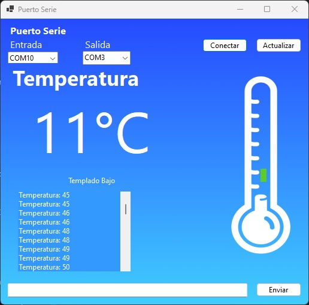
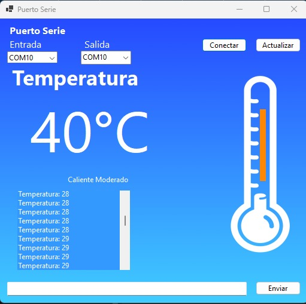
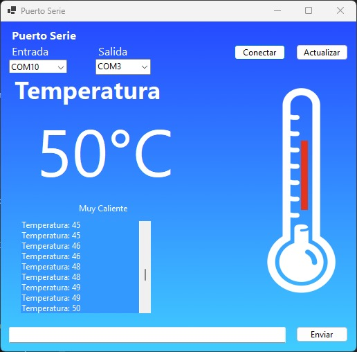

# Proyecto de Sensor de Temperatura con Bluetooth y DHT11

Este proyecto utiliza un sensor DHT11 para medir la temperatura y transmitir los datos a través de Bluetooth utilizando un módulo de comunicación **HC-05**. Los datos también se muestran en una interfaz gráfica creada con **Windows Forms** usando **Visual Studio Community**. El termómetro gráfico cambia de color y estado de acuerdo con la temperatura recibida.

## Características

- **Lectura de temperatura** usando un sensor **DHT11**.
- **Visualización en pantalla** con etiquetas que muestran la temperatura y el estado (Frío, Templado, Caliente).
- **Transmisión de datos** a través de **Bluetooth** usando un módulo HC-05.
- **Interfaz gráfica creada con Windows Forms en Visual Studio Community**.
  
## Componentes

- **Arduino Uno** 
- **Sensor DHT11** (para medir la temperatura)
- **Módulo Bluetooth HC-05** (para la comunicación inalámbrica)
- **Cables de conexión**
- **Interfaz gráfica creada con Windows Forms usando Visual Studio Community**

### Sensor DHT11:

- **VCC** -> 5V en el Arduino
- **GND** -> GND en el Arduino
- **DATA** -> Pin Digital 3 en el Arduino

### Módulo Bluetooth (HC-05):

- **VCC** -> 5V en el Arduino
- **GND** -> GND en el Arduino
- **RX** -> Pin Digital 10 en el Arduino
- **TX** -> Pin Digital 11 en el Arduino

## Funcionamiento

1. Conecta el hardware de acuerdo a las instrucciones de conexiones.
2. Carga el código de Arduino para comenzar a leer las temperaturas y transmitir los datos a través de Bluetooth.
3. Ejecuta la aplicación de Windows Forms en **Visual Studio Community** para visualizar la temperatura en la interfaz gráfica.
4. Los datos de temperatura se mostrarán en la interfaz gráfica, junto con una representación visual del termómetro y su estado correspondiente:
   - **Frío** (azul): 0 - 10 °C
   - **Templado Bajo** (verde): 11 - 20 °C
   - **Templado Alto** (amarillo): 21 - 30 °C
   - **Caliente Moderado** (naranja): 31 - 45 °C
   - **Muy Caliente** (rojo): mas 46 °C

## Capturas de Pantalla

## Uso de la Interfaz Gráfica

- El **ComboBox de Entrada** y **ComboBox de Salida** permiten seleccionar los puertos de conexión para la comunicación serie.
- El botón **Conectar** inicia la comunicación entre el sensor de temperatura y la interfaz gráfica.
- El botón **Actualizar** refresca la lista de puertos disponibles.
- El panel del termómetro y las etiquetas de **Temperatura** y **Estado** se actualizan automáticamente conforme llegan los datos.

## Herramientas Utilizadas

- **Visual Studio Community**: Entorno de desarrollo integrado (IDE) para crear la interfaz gráfica con **Windows Forms**.
- **Arduino IDE**: Para cargar el código al Arduino y controlar el sensor DHT11 y el módulo Bluetooth.
  
